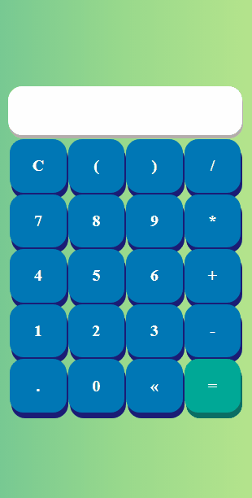

<h1 align="center">Simple calculator</h1>

<h2 style="margin-top: 2rem">Navigation Links</h2>

  <a href="#description">Description</a> |
  <a href="#calculator">Calculator</a> |
  <a href="#technologies">Technologies</a> |
  <a href="#testhere">Test here</a> |
  <a href="#author">Author</a>

 

<h2 id="description">Description</h2>

 

Calculator mini project, responsive and simple, containing some basic operators that are: addition, subtraction, division, multiplication and parentheses. In the field of features, we have a button width letter C that serves to delete everything, the arrow to clear only one character at a time and equals symbol to calculate the result.

 

<h2 id="calculator">Calculator</h2>

 

 
  

 

<h2 id="technologies">Technologies</h2>

 

The following technologies were used in the mini project:

- [Html](https://developer.mozilla.org/pt-BR/docs/Web/HTML)
- [Css](https://developer.mozilla.org/pt-BR/docs/Web/CSS)
- [JavaScript](https://developer.mozilla.org/pt-BR/docs/Web/JavaScript)

 

<h2 id="testhere">Teste Aqui</h2>

 

[Pages Github](https://diogofranca.github.io/simple-calculator/)

 

<h2 id="author">Author</h2>

 

Made with ❤️ by Diogo França 🎉

